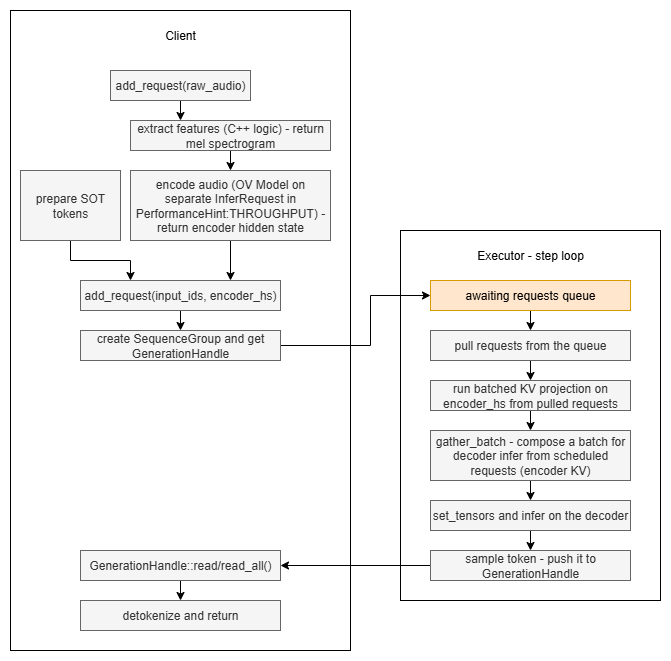

# Whisper Continuous Batching in OpenVINO GenAI — Proof of Concept Summary

> This document covers motivation, design decisions, implementation design, preliminary observations and recommendations.
> The idea should be applicable for all Whisper variants, but I worked with whisper-v3-large during this POC
> so this document focuses on that specific variant. This document has been created with help of AI.
> Apologies if I missed catching any incorrect parts in the process.

---

## Table of Contents

1. [Motivation](#1-motivation)
2. [High-Level Design](#2-high-level-design)
3. [Implementation Details](#3-implementation-details)
   - 3.1 [Why the Standard SDPAToPagedAttention Does Not Work Out of the Box](#31-why-the-standard-full-pass-sdpatopagedattention-does-not-work-out-of-the-box)
   - 3.2 [Selective PagedAttention and Graph Rewrites](#32-selective-pagedattention-and-graph-rewrites)
   - 3.3 [PROMPT, TRANSITION, and GENERATE Phases](#33-prompt-transition-and-generate-phases)
   - 3.4 [Cross-Attention K/V Projection Cache](#34-cross-attention-kv-projection-cache)
   - 3.5 [OpenVINO Core Changes Required](#35-openvino-core-changes-required)
   - 3.6 [GPU-Specific Fix: Always Call set_tensor for Cross-KV](#36-gpu-specific-fix-always-call-set_tensor-for-cross-kv)
4. [Correctness Validation](#4-correctness-validation)
5. [Performance Methodology](#5-performance-methodology)
   - 5.1 [Benchmark Application](#51-benchmark-application)
   - 5.2 [Metrics Collected](#52-metrics-collected)
   - 5.3 [Benchmark Modes](#53-benchmark-modes)
   - 5.4 [Relevant Parameters and Their Effect](#54-relevant-parameters-and-their-effect)
   - 5.5 [Comparison with vLLM Serving](#55-comparison-with-vllm-serving)
6. [Performance Results](#6-performance-results)
   - 6.1 [Hardware Configurations Tested](#61-hardware-configurations-tested)
   - 6.2 [Exact Commands](#62-exact-commands)
   - 6.3 [Result Tables](#63-result-tables)
7. [Summary and Recommendations](#7-summary-and-recommendations)

---

## 1. Motivation

Whisper is an encoder-decoder speech recognition model. Deployed in a service context the model must
handle a continuous stream of short audio clips arriving from concurrent clients (telephony
transcription, real-time meeting notes, etc.). A current deployment runs each clip sequentially
through a single `WhisperPipeline::generate()` call:

```
Client 1:  [encode][decode tok 1][decode tok 2] ... [decode tok N]
Client 2:                                                           [encode][decode tok 1] ...
```

This behavior might be good for single client real-time load, but when we need to handle multiple 
input sources it is not the most optimal solution as:

1. **GPU/CPU compute utilisation is low.** During the sequential decoder loop the hardware executes
   a batch-size-1 matrix multiplication at each step. With transformers based decoders, we can tell that batching is generally 
   a good idea, especially on GPU.

2. **Queuing latency grows linearly with load.** At a request rate *r* and average service time *T*,
   even moderate traffic causes requests to queue (Little's Law: *L = r·T*). Under burst conditions
   queuing latency dominates total latency.

**Continuous batching** (also called *iteration-level scheduling*) addresses this by merging
independent requests into a single forward pass at each decode step. Requests that arrive mid-flight
join the running batch immediately rather than waiting in a queue. This flexibility is important in serving scenario
where we cannot control requests arrival pattern which can potentially fluctuate a lot.

*Note:* With low max output token (448 per audio sample for Whisper) even static batching might be an optimization 
worth considering, especially in an offline, long audio scenario where we could potentially partition long sample into
multiple smaller once, process in batches and join results together in a static, yet more throughput oriented scenario.
But static batching was out-of-scope for this POC.  

Applying continuous batching to Whisper is non-trivial because Whisper is an encoder-decoder model with cross-attention
— the standard CB path in OpenVINO GenAI (`ContinuousBatchingPipeline`) was designed for
decoder-only transformers with paged self-attention KV caches. The goal of this POC was to determine
whether Whisper can be adapted to use the existing CB infrastructure and whether doing so provides
meaningful throughput and latency benefits.

---

## 2. High-Level Design

The POC extends OpenVINO GenAI's `ContinuousBatchingPipeline` to support Whisper. The key changes
span three areas:

| Area | What was done |
|---|---|
| **Model graph** | Applied `SDPAToPagedAttention` only to self-attention SDPA nodes; cross-attention nodes remain as SDPA |
| **Cross-KV cache** | New `CrossKVCache` class: caches cross-attention K/V projections in a per-request slot buffer; projection is batched across all newly-arrived requests at the start of each `step()` and stored once per request; `gather_batch()` assembles the current scheduled batch on every step |
| **Pipeline integration** | Extended `ContinuousBatchingPipeline` with  `add_request(raw_audio)` that handles computing features, running encoding, preparing SOT tokens and queueing requests for `step()` to collect and process |

The flow per request:




```
Audio in (one per request; multiple requests may encode concurrently with decoding)
  │
  add_request(raw_audio)
  │
  ▼  
    encode_speech()
      ├─ feature extraction                  ← mel spectrogram
      ├─ SpeechEncoder::infer()              ← encoder model, runs once per audio clip
      │    → encoder_hidden_states [1, T_enc, D]
      └─ initial prompt tokens               ← SOT sequence (language, task, etc.)
      │
      ▼ 
    add_request(input_ids, encoder_hs)       ← non-blocking: creates SequenceGroup,
  │                                         pushes encoder_hs to pending projection queue,
  │                                         returns GenerationHandle immediately
  │
  ▼
step() loop (focus on whisper specific stuff - scheduler etc. are still there, just not mentioned):
  │
  ├─ _flush_pending_projections()        ← batched cross-KV projection (done once per step)
  │    stack all pending encoder_hs into [N, T_enc, D]
  │    projector.infer()                 ← runs K/V projection for all N requests in one call
  │    CrossKVCache::admit_batch()       ← stores K/V into per-request slots in parallel
  │
  ├─ gather_batch()                      ← assemble cross-KV for the currently scheduled batch
  │    output: [N, n_heads, T_enc, head_dim] per layer
  │
  ├─ set_tensor(cross_kv_K_l, cross_kv_V_l)  for all layers
  │
  ├─ infer()                             ← decoder: paged self-attention + cross-attention SDPA
  │
  └─ sample tokens                       → GenerationHandle receives new tokens
```

---

## 3. Implementation Details

### 3.1 Why the Standard Full-Pass SDPAToPagedAttention Does Not Work Out of the Box

OpenVINO's `SDPAToPagedAttention` pass converts **all** SDPA operations to PagedAttention
extensions. For decoder-only models this is correct. For Whisper, applying it blindly to
cross-attention nodes causes a runtime failure: the PagedAttention operator expects a block-table
and paged KV pool that the existing CB infrastructure only wires up for the *growing* decoder KV —
not for the fixed-size encoder output.

The properties of the two attention types differ significantly:

| Property | Self-attention (decoder → decoder) | Cross-attention (decoder → encoder) |
|---|---|---|
| KV source | Generated incrementally per step | Fixed encoder output, computed once per audio clip |
| KV length | Grows with each generated token | Always 1500 positions (Whisper encoder output) |
| PagedAttention | Required and natural (handles dynamic growth efficiently) | Possible but adds complexity: requires a separate KV pool sized for encoder outputs |

**The production-grade path — as implemented by vLLM for encoder-decoder models — is to page
both self-attention and cross-attention KV.** This requires a second, independent KV block pool
(block size and element count differ for encoder vs decoder KV), separate block tables per layer,
and changes to how the PA operator receives cross-attention inputs. It is the right design for a
shipped product but is significantly more invasive to implement.

For this POC the cross-attention paging was deliberately avoided. Instead, cross-attention K/V
projections are cached in a flat slot buffer (`CrossKVCache`, described in §3.4) and fed to the
decoder as dense tensors via SDPA on every step. This avoids all paging infrastructure changes at
the cost of a gather + `set_tensor` call per step.

### 3.2 Selective PagedAttention and Graph Rewrites

The solution applies `SDPAToPagedAttention` selectively:

1. Scan the model graph for all `ScaledDotProductAttention` nodes.
2. Classify by node name: nodes containing `"encoder_attn"` or `"cross_attn"` are cross-attention;
   all others are self-attention.
3. Save the input connections of cross-attention nodes.
4. Run `SDPAToPagedAttention` on the full model (it converts all SDPA to PA).
5. Restore cross-attention nodes from saved connections, replacing each `PagedAttentionExtension`
   back to the original SDPA.

This gives a hybrid model: self-attention runs through the paged KV cache mechanism, cross-attention
uses the standard SDPA path receiving pre-projected K/V tensors gathered from `CrossKVCache`.

After transformation the decoder model has these additional inputs (beyond original Whisper inputs):

- `block_indices_begins`, `block_indices`, `subsequence_begins`, `past_lens`, etc. — standard PA
  paging parameters managed by the CB scheduler
- `cross_kv_K_0` … `cross_kv_K_31`, `cross_kv_V_0` … `cross_kv_V_31` — per-layer cross-attention
  K/V tensors assembled by `CrossKVCache::gather_batch()`

Three additional graph rewrites are applied as part of `apply_selective_pa_transformation()` to
make the hybrid model functionally correct for multi-request batching.

#### Segmented Cross-Attention Subgraph

Each Whisper request carries its own audio clip and therefore its own encoder output — a `[1, T_enc, D]`
tensor unique to that clip. In a batched forward pass with N concurrent sequences the cross-attention
Q tensor has shape `[1, n_heads, N, head_dim]` (all N tokens from all N sequences, one token each).
A naive SDPA over the batched K/V `[N, n_heads, T_enc, head_dim]` would let every query attend to
every encoder sequence — semantically wrong: request 3's decoder should only ever see request 3's
audio representation.

The segmented cross-attention subgraph applies a Q-transpose trick (no custom op required) that
enforces per-sequence isolation:

```
Q  [1, n_heads, N, head_dim]
  → Transpose [2,1,0,3]
  → [N, n_heads, 1, head_dim]   ← N batch slots, 1 query each
  → SDPA(K=[N, n_heads, T_enc, head_dim],
         V=[N, n_heads, T_enc, head_dim])
  → [N, n_heads, 1, head_dim]
  → Transpose [2,1,0,3] (self-inverse)
  → [1, n_heads, N, head_dim]
```

With this layout SDPA treats each of the N entries as an independent batch slot: query i attends
only to K/V row i — sequence i's encoder output. Correct semantic isolation is guaranteed for any N.

**Critical assumption — T=1 per sequence.** The trick works only when `total_tokens == N`, i.e.
every sequence contributes exactly **one** token to the forward pass. If a sequence contributed T>1
tokens, total_tokens would be N×T and the N batch-slot-to-N-encoder-state mapping would break:
multiple queries from the same sequence would land in different batch slots and attend to different
(wrong) encoder states. This is one of the two reasons why Constraint 1 in §3.3 (`max_num_tokens_per_prefill_step = 1`)
is a hard correctness requirement, not just a numerical preference.

#### Cross-Attention `ReadValue`/`Assign` Bypass and K/V Parameter Extraction

`SDPAToPagedAttention` converts self-attention stateful KV (`ReadValue`/`Assign` pairs) to stateless
PA parameters, but it leaves cross-attention nodes alone. The original exported Whisper decoder
stores cross-attention K and V projections (`K = encoder_hs · W_K^T`, `V = encoder_hs · W_V^T`)
in `ReadValue`/`Assign` state nodes — the Assign writes the projection after the very first forward
pass, and every subsequent step reads the cached value.

In a CB pipeline this is broken: the CB inference request is never reset between steps, so
`ReadValue` always holds the state from the previous step's batch — which may be a completely
different batch composition. At cold start it holds all-zeros; after any batch change it holds
stale K/V for the wrong set of requests. Either way, cross-attention runs on wrong values from
the first PROMPT step onward. PROMPT steps discard their logits, so the first visibly wrong token
appears at TRANSITION — but the self-attention KV cache written during PROMPT is also computed
from wrong cross-attention outputs and those errors carry forward into GENERATE.

The fix is performed in two passes during `apply_selective_pa_transformation()`:

**Pass 1 — bypass the ReadValue.** For each cross-attention SDPA, walk back from its K and V
inputs to find the `ReadValue` node sitting in that path. Rewire the SDPA's K and V inputs to
bypass the `ReadValue` entirely — connecting them directly to the projection computation
(`W_K · encoder_hidden_states`, `W_V · encoder_hidden_states`). Remove the corresponding
`Assign` sinks. After this pass cross-attention K/V are re-projected from `encoder_hidden_states`
on every forward call — correct, because encoder output never changes during a decode sequence.
But the projection still runs inside the decoder on every step for every batch element.

**Pass 2 — extract the projection as explicit model inputs.** `extract_cross_attn_projector()`
takes those K/V projection chains out of the decoder and into a separate projector `ov::Model`.
Inside the decoder, the K/V projection outputs are replaced with new `Parameter` nodes named
`cross_kv_K_{l}` and `cross_kv_V_{l}` — plain tensor inputs the decoder reads from on every
`infer()` call. The result: the decoder no longer computes K/V projections at all; it receives
projected K/V as external inputs, the same way it receives `input_ids` or `past_lens`.

Those `cross_kv_K_{l}` / `cross_kv_V_{l}` inputs are what `CrossKVCache::gather_batch()` fills
before each forward call (§3.4). Because projection is now outside the decoder loop, it can be
run once per request instead of once per step per request — the core efficiency
gain of the cross-KV cache.

#### `lm_head` Tensor-Rank Fix

After the above graph modifications, the CPU plugin's kernel-fusion for `LayerNorm + FullyConnected`
silently produces all-zero output when the activation tensor has rank 3 and T>1 (shape `[bs, T, H]`).
The fusion goes wrong in the modified graph; for rank 3 with T=1 the plugin falls through to a
GEMV path that works. The fix inserts Reshape nodes around `lm_head`:

```
[bs, T, H]  →  Reshape  →  [bs·T, H]  →  MatMul(W^T)  →  [bs·T, V]  →  Reshape  →  [bs, T, V]
```

The rank-2 activation bypasses the broken fusion path and is numerically identical to the original.
With Constraint 1 (T=1) enforced at runtime this bug would never be triggered in practice, but the
fix is retained as a defensive graph-level guard since the constraint is set at the pipeline
configuration level — the graph itself has no way to enforce it.

### 3.3 PROMPT, TRANSITION, and GENERATE Phases

The CB scheduler tracks three phases per request:

- **PROMPT** (`!requires_sampling()`): the request is still consuming its SOT prefix —
  self-attention KV entries are being written but no output tokens are sampled yet.
- **TRANSITION** (`requires_sampling() && !can_generate_tokens()`): the last SOT token is being
  processed; this step writes the final prefix KV entry and simultaneously produces the first
  sampled token. The request moves to GENERATE on the next step.
- **GENERATE** (`can_generate_tokens()`): standard autoregressive loop — one token per step,
  KV read dominant, output sampled.

For Whisper, in this POC, the SOT prefix is 4 tokens (`<|startoftranscript|>`, language tag, task tag,
`<|notimestamps|>`), so a request injected at step S progresses as: PROMPT at steps S–S+2,
TRANSITION at step S+3, GENERATE from step S+4 onward.

#### Constraint 1: One SOT token per step (`max_num_tokens_per_prefill_step = 1`)

The scheduler is configured with `max_num_tokens_per_prefill_step = 1`, which limits each PROMPT
sequence to contributing exactly **one** token to any single forward pass. This processes the
4-token SOT prefix over 4 separate steps rather than in one batched call.

This constraint serves two distinct purposes.

**Cross-attention routing correctness (structural requirement).** The segmented cross-attention
subgraph (§3.2) routes query i to encoder state i by transposing Q from `[1, n_heads, N, head_dim]`
to `[N, n_heads, 1, head_dim]`. This N-slot-to-N-encoder mapping holds only when every scheduled
sequence contributes exactly one token — `total_tokens == N`. If T>1 were allowed during PROMPT
passes, a sequence with T=4 tokens would occupy four consecutive slots and each of those queries
would be routed to a different encoder state, most of them belonging to other requests. The result
is not numerical drift — it is completely wrong cross-attention output from step 1, affecting every
layer and compounding immediately. T=1 is therefore a hard structural correctness requirement for
any model that uses the segmented cross-attention transform.

**Self-attention KV consistency (numerical correctness).** In the GENERATE phase, every request
always contributes exactly one token per step — that is not a constraint we impose but a property
of autoregressive decoding. Every KV entry written during GENERATE is therefore written under
"current batch size N, one token per request" conditions. Without this constraint, a PROMPT pass
could process T=4 SOT tokens in a single forward call, writing all 4 context entries under an M=4
matrix multiply in one shot. Those 4 SOT entries would then be structural outliers in that request's
own context — written in a different per-request regime than every GENERATE entry that follows.
With T=1 enforced, every KV write in the system is "current N, one token per request", regardless
of phase.

Note: at the raw kernel level shape axes don't matter — `[N=4, T=1, hidden]` and `[N=1, T=4,
hidden]` both flatten to an M=4 matrix multiply with identical AMX tile layout. The axis is
irrelevant; what matters is that T=1 makes PROMPT structurally equivalent to GENERATE.

#### Constraint 2: Isolated forward passes for PROMPT sequences

With T=1 per sequence enforced, the phase split's only job is to keep GENERATE sequences out of
the PROMPT forward pass — preventing them from inflating N_prompt to N_total. A single new
arrival into a batch of 12 writes its SOT KV at N=1 instead of N=13; 4 simultaneous arrivals
write at N=4 instead of N=16. This is best-effort, not exact: it reduces the matrix size at PROMPT
write time to the minimum the arrival pattern allows, but cannot prevent N from varying during
GENERATE (where it changes on every step as requests join and leave).

**Why the SOT prefix is more sensitive than GENERATE context.** GENERATE sequences accumulate
hundreds of tokens. Each step writes one KV entry under the current N; per-step accumulation
deviations are diluted across a growing history so no single entry dominates. The 4 SOT entries
have no such averaging — they are the entire self-attention context for the TRANSITION step and
the early GENERATE steps. An error in any of them is the full signal, not a small perturbation
in a large average, and it compounds through all 32 decoder layers.

TRANSITION and GENERATE sequences are safe to batch together: PagedAttention handles heterogeneous
`past_len` by design, and the cross-attention slot assignment is per-request. Batching them
eliminates one extra forward call per step.

**Additional Whisper rule — solo passes for staggered PROMPT sequences:** this rule is specific
to Whisper's modified PA graph and does not apply to standard decoder-only models. In a
standard CB system, two chunked-prefill requests with different `past_len` values (e.g. one at
chunk 3, another at chunk 1) batch correctly — heterogeneous `past_len` during prefill is a core
PA feature.

In Whisper's case the root cause is in how `SDPAToPagedAttention` classifies Whisper's
self-attention nodes. The standard Whisper decoder exports self-attention as an SDPA node with
`is_causal=false` plus an explicit lower-triangular mask tensor as the fourth input. This is
structurally different from the decoder-only LLaMA/GPT pattern where the SDPA is `is_causal=true`
and has no explicit mask. `SDPAToPagedAttention` follows a different internal code path for the
non-causal + explicit-mask form, producing a PA node variant that relies on the mask to enforce
causality during the prefill (PROMPT) phase.

The mask-dependent variant has a different interpretation of the `past_len` paging parameters
when multiple PROMPT sequences are batched together. Specifically: when the batch contains two
PROMPT sequences with heterogeneous `past_len` values (e.g. `[1, 0]` because request A arrived
one step before request B), the kernel's physical block-slot write logic uses the minimum
`past_len` in the batch as the base write offset for all sequences. This causes the sequence
with the higher `past_len` (request A, at position 1) to have its KV entry written to position 0
of its physical block — overwriting or colliding with the entry it actually wrote at position 0
in the previous step. All subsequent generation for that request reads from a corrupted KV cache.

When `past_len` values are symmetric — `[0,0]`, `[1,1]`, etc., as happens when all requests are
injected at the same step and advance together — the shared offset is always correct and the
kernel operates without error. The fix runs each staggered PROMPT group (sequences sharing the
same `past_len`) in its own isolated forward pass, so every batch fed to the kernel is
homogeneous. This eliminates the offset ambiguity at the cost of additional forward calls.

**Forward-pass count per `step()`:**

| Situation | Number of `forward()` calls |
|---|---|
| Single phase, no staggering | 1 |
| PROMPT + TRANSITION/GENERATE, all PROMPT groups share same `past_len` | 2 |
| PROMPT + TRANSITION/GENERATE, staggered PROMPT groups (different `past_len`) | 1 per PROMPT group + 1 for TRANSITION+GENERATE |
| PROMPT only, staggered | 1 per PROMPT group |

In the worst case — many PROMPT sequences each at a different SOT position — there are as many
forward calls as there are PROMPT groups, plus one for TRANSITION+GENERATE. In practice,
requests tend to arrive in small bursts and advance in lockstep (same `past_len`), keeping the
count at 2.

#### What these two constraints achieve — and what they don't

Both constraints together ensure every PROMPT forward pass processes exactly N_prompt × 1 tokens
— the smallest achievable matrix given the arrival pattern. T=1 is an exact guarantee; N=N_prompt
is the best the scheduler can do. Neither constraint eliminates N-variation during GENERATE, which
is inherent to any CB system where requests join and leave continuously.

The constraints are not a correctness guarantee; they are mitigation. They eliminate catastrophic
failures (text errors, premature `<|endoftext|>`) while accepting that residual timestamp drift
persists in high-concurrency GENERATE scenarios (confirmed by §4 results: all 12 scenarios produce correct transcription text;
scenarios with multiple concurrent requests in GENERATE show residual timestamp drift). That residual is an inherent
consequence of finite-precision arithmetic under varying-N batching and would exist regardless.

#### Why these constraints are Whisper-specific

The standard OpenVINO GenAI CB implementation for decoder-only models (LLaMA 3, GPT variants,
etc.) does neither of the above. Chunked prefill at T>1 works correctly for those models, and
there is no phase-split logic. The reasons Whisper requires special treatment are two independent
factors that compound:

**Factor 1 — Whisper's PA variant has worse multi-token PROMPT-path numerics.**
Decoder-only models export self-attention as `is_causal=true` SDPA with no mask. `SDPAToPagedAttention`
converts this to the standard PA node. That node's multi-token PROMPT path (batched GEMM, T>1) and
single-token GENERATE path (GEMV, T=1) accumulate floating-point in different orders, but the
divergence is small and tolerable.

Whisper exports self-attention as `is_causal=false` plus an explicit triangular mask (§3.2), which
causes `SDPAToPagedAttention` to produce a different, mask-dependent PA variant. This variant's
multi-token PROMPT path has significantly larger floating-point divergence from the GENERATE path:
empirically, the timestamp logit probability drops from ~51% (correct) to ~14.6% (below the beam-forcing
threshold), which immediately causes wrong first tokens. The T=1 constraint forces every SOT step
through the numerically stable GENERATE path, bypassing this variant's broken PROMPT path entirely.

**Factor 2 — the SOT prefix is 4 tokens, so there is nothing to dilute the error.**
A decoder-only model's user prompt is typically tens to hundreds of tokens. Even if the PA PROMPT
path introduced small per-entry drift, a decode step that attends over 200 prefix entries plus 1
generated entry treats those few drifted entries as statistical noise relative to the bulk of correct entries.

Whisper's SOT prefix is 4 tokens. Those 4 entries are the *entire* self-attention context for the
TRANSITION step and the early GENERATE steps. There is no bulk of correct entries to average against:
any error in the SOT entries is the full signal and it compounds through all 32 decoder layers,
producing visible timestamp drift or premature `<|endoftext|>`.

Note that LLaMA/GPT chunked prefill also writes KV entries under T>1 conditions that differ slightly
from the T=1 GENERATE entries written later — the model structure is not fundamentally more "uniform"
than Whisper's. The constraints are Whisper-specific because Whisper's combination of a numerically
worse PA variant (Factor 1) and an unusually short prefix (Factor 2) makes the problem visible and
catastrophic, whereas for decoder-only models the same underlying effect is both smaller and diluted.

**Why SDPA Whisper can process the full SOT in one forward pass.** The standard non-CB
`WhisperPipeline` uses SDPA (plain scaled-dot-product) for decoder attention,
not the PagedAttention kernel. Two properties of SDPA make the T>1 SOT pass safe:
1. SDPA does not use AMX tiled blocking — it is a single unfused kernel whose accumulation order
   is independent of T. There is no per-tile roundoff that changes with sequence length.
2. The standard pipeline always runs N=1 (one request at a time). There is no batch dimension
   for accumulation to depend on, and no other request to contaminate the KV context.

Once the decoder is adapted to PagedAttention (as in the CB version), the kernel changes to an
AMX-tiled GEMM whose accumulation order is sensitive to both T and N. That is the trigger for
both constraints described above.

#### Whisper-Specific Logit Processing in `step()`

The standard Whisper pipeline applies `process_whisper_logits()` after every forward pass and
before sampling: it suppresses non-timestamp tokens on the first free step, suppresses a
configured list of tokens on every step, and enforces timestamp token rules (`return_timestamps`).
The CB pipeline has no automatic equivalent — only the generic sampler with no Whisper awareness.
Without it, the first unconstrained prediction at the TRANSITION step is an arbitrary token
(e.g. `.` = token 13) rather than the required timestamp, and all subsequent generation seeds
from that wrong token.

The fix applies Whisper logit processing inside `step()` after `forward()` and before `sample()`:

1. **`begin_suppress_tokens`** — suppressed on the initial step only (the TRANSITION step, where
   `generated_ids` is still empty).
2. **`suppress_tokens`** — suppressed on every step that produces a logit row.
3. **`process_whisper_timestamp_logits`** — applied when `return_timestamps=true`; enforces
   timestamp probability weighting and consecutive-timestamp EOS rules.

**Critical: iterate in scheduler order, not request-insertion order.** The logit tensor produced
by `forward()` is laid out in the order the scheduler placed sequences into the batch — which
may differ from `m_requests` insertion order when the scheduler applies a PROMPT-first policy.
Iterating `m_requests` instead causes logit rows to be applied to the wrong requests, giving
late-arriving requests incorrect logit masks → premature `<|endoftext|>`. The implementation
walks `scheduler_output.m_scheduled_sequence_groups_ids` and tracks a running `offset` to index
into the flat logit tensor correctly.

PROMPT-phase sequences (`!requires_sampling()`) produce no logit rows and are skipped with a
zero offset advance.

### 3.4 Cross-Attention K/V Projection Cache

**The problem:** In Whisper, each cross-attention layer computes its keys and values by projecting
the encoder hidden state through learned weight matrices. In the original model this projection
happens inside every decode step for every request in the batch. At N=5 concurrent requests and
50 decode steps: 5 × 50 × 32 layers = 8000 projection operations — almost all redundant since the
encoder hidden state does not change between steps.

**`CrossKVCache`** runs the cross-KV projections exactly once per request and caches the result
in a pre-allocated slab of memory. Projections are not run at `add_request()` time — instead,
the encoder hidden states are pushed to a pending queue and `_flush_pending_projections()` inside
`step()` processes the whole queue in one batched projector call, amortising the fixed overhead
across all newly-arrived requests:

```
Layout:  m_buffer[n_layers, 2, max_slots, n_heads, T_enc, head_dim]
                  ^^^^^^^^  ^  ^^^^^^^^^  ^^^^^^^^^^^^^^^^^^^^^^^^
                  32 layers  K/V  e.g. 16  each slot is one request's K/V
```

Key design decisions:

- **Separate projector model.** The K/V projection weights are extracted from the decoder at init
  time via `extract_cross_attn_projector()`. The projector runs `encoder_hs → cross_proj_K_l /
  cross_proj_V_l` independently of the decoder, enabling concurrent encoder+projector inference
  overlapped with ongoing CB steps. Setting `CROSS_KV_CACHE=0` disables extraction — the decoder
  retains the K/V projection chains and re-runs them from `encoder_hidden_states` on every
  `forward()` call, as in the original stateless-but-uncached path. This is the correctness
  baseline used in scenario 12 (§4.2).

- **Optional bf16 storage.** The `CROSS_KV_PRECISION` environment variable (default: same as
  compute type) controls whether slots are stored in bf16. This halves DRAM/L3 footprint at the
  cost of a conversion on gather. For Whisper-large-v3: 32 layers × 2 × 1500 × 20 heads × 64 =
  ~469 MB per slot in f32; ~234 MB in bf16.

- **Fast paths in `gather_batch()`.** Two cases avoid copying:
  - *N=1*: `gather_batch()` wraps the slot-buffer pointer directly as an `ov::Tensor` with no
    memcpy.
  - *Unchanged batch (any N)*: when the set of scheduled request IDs is identical to the previous
    step, `gather_batch()` takes an early exit and returns immediately — the tensors already bound
    to the model are still valid. No copy, no `set_tensor` call (on CPU; GPU always calls
    `set_tensor` per §3.6).

- **Parallel gather for N>1 (changed batch).** When the batch composition has changed,
  `gather_batch()` assembles the cross-attention projected K/V tensors for the current batch from
  the slot buffer. It launches one async task per `(layer × K/V)` — up to `n_layers × 2 = 64`
  tasks, one per cross-attention layer and K or V. Each task gathers *all N requests'*
  non-contiguous cross-KV slot-buffer slices for that (layer, K/V) pair into a single contiguous
  output tensor. The parallelism is across the 64 layer/KV dimensions; within each task the N
  slices are copied sequentially.

  **Why this decomposition?** The naive alternative is to process requests one by one — for each
  request copy all 64 layer/KV slices sequentially, producing N sequential passes over the buffer.
  This has two drawbacks: it is single-threaded, and each pass interleaves reads across all 64
  layer positions in the buffer, reducing cache locality.

  The layer/KV decomposition instead assigns one task per output tensor: `cross_kv_K_l` and
  `cross_kv_V_l` are independent buffers, so 64 tasks can fill them simultaneously with no
  synchronization. Within each task the N copies are all reads from the same layer/KV slice of
  `m_buffer` — spatially close in memory — which improves prefetcher efficiency. Each individual
  slice is a contiguous region (~7.3 MB in f32), so each copy is a single large sequential read
  and write rather than many scattered accesses. On a many-core Xeon the 64-way parallelism also
  maps well to the available hardware threads, hiding DRAM latency by keeping all memory
  controllers busy in parallel.

  **Concrete example — 16 scheduled requests, Whisper-large-v3:**

  The 16 active requests occupy some subset of the allocated slots, say slots
  `[0, 2, 5, 7, 8, 11, 12, 14, 15, 17, 20, 22, 25, 28, 30, 31]` — not contiguous in
  `m_buffer`.

  64 async tasks are launched concurrently. Each task handles one `(layer, K_or_V)` pair,
  e.g. task for `(layer=0, K)`:
  ```
  source (non-contiguous): m_buffer[layer=0, K, slot_id, :, :, :]
                               for slot_id in [0,2,5,7,8,11,12,14,15,17,20,22,25,28,30,31]
                               each slice shape: [n_heads=20, T_enc=1500, head_dim=64]

  destination (contiguous): cross_kv_K_0[request_index, :, :, :]
                               output shape: [N=16, 20, 1500, 64]
  ```
  The task copies 16 slices sequentially into the output, each slice ~7.3 MB (f32).
  All 64 tasks run in parallel, covering all 32 layers × K and V simultaneously.

- **Slot lifecycle.** A free-list manages `max_slots` slot indices. `admit()` blocks until a free
  slot is available (back-pressure). `release()` returns the slot on request completion.
  `max_slots` is computed from available memory at init time.

### 3.5 OpenVINO Core Changes Required

The CB pipeline exercises dynamic shapes and paged attention in ways that exposed several issues in
the OpenVINO CPU plugin. The following modifications were made to the OV source tree to allow the
Whisper CB pipeline to run correctly:

| File | Change | Reason |
|---|---|---|
| `src/plugins/intel_cpu/src/nodes/paged_attn.h` | `isExecutable()` uses runtime edge memory descriptors instead of stale `inputShapes[]` | At N=1 the paged-attn node receives zero-dim inputs (no tokens to process in PROMPT phase). `isExecutable()` was checking pre-compiled static shapes from an earlier compilation, which still showed non-zero dims — causing the node to be spuriously skipped instead of correctly treated as a no-op, producing wrong output |
| `src/plugins/intel_cpu/src/node.cpp` | `outputHasZeroDims()` helper; late shape inference in `executeDynamic()`; InternalDyn PA handling; `inputShapesDefined` / `outputShapesDefined` use `isStatic()` | The scheduler dynamically changes batch size N on every step. When N=0 (no sequences in GENERATE phase), the PA node's output shapes become zero-dimensional. The existing code inferred shape status from static compile-time information, so zero-dim dynamic outputs were wrongly classified as non-executable and skipped, breaking the step loop |
| `src/plugins/intel_cpu/src/graph.cpp` | Skip undefined PA outputs in `PullOutputData`; use `getDims()` instead of `getStaticDims()`; force `set_shape` when `ext_blob_ptr` is null | After a step where N=0, PA output tensors have no valid static shape yet. `PullOutputData` was calling `getStaticDims()` on these tensors, crashing on the missing shape. Changed to `getDims()` (which works with dynamic shapes) and skip outputs whose shape hasn't resolved yet |
| `src/plugins/intel_cpu/src/infer_request.cpp` | `PullOutputData` before `update()` (output buffer rotation fix); null-ptr guard in `set_tensor` | The CB pipeline reads output tensors from one step and immediately reuses the inference request for the next step. The original order called `update()` (which rotates internal buffers) before `PullOutputData()`, so the output tensors were already overwritten with the next step's state before they could be read |
| `src/plugins/intel_cpu/src/nodes/reshape.cpp` | `needShapeInfer()` guard for non-static shape-spec input | Reshape nodes that receive a dynamic shape specification tensor were re-running shape inference on every step even when the specification hadn't changed, adding unnecessary overhead to each CB step |

These changes have been pushed to a fork and can be reviewed in: https://github.com/mzegla/openvino/pull/1

### 3.6 GPU-Specific Fix: Always Call set_tensor for Cross-KV

On CPU, `ov::InferRequest::set_tensor()` stores a host pointer — the model reads directly from
host memory on every `infer()` call, so calling it once when the buffer address changes is sufficient.
On GPU, `set_tensor()` triggers a **host-to-device (H→D) upload** of the tensor data. The original
code skipped `set_tensor()` when batch size N was unchanged (even if the batch *composition* changed),
so the GPU retained stale cross-KV values from the previous step, causing all requests to produce
repetitive wrong output (`"in in in in ..."`).

Fix: `set_tensor()` is now called whenever `gather_batch()` actually re-gathered data (i.e. the
unchanged-batch early-exit was not taken), regardless of whether N changed. The overhead on CPU
is negligible (~ns pointer store).

---

## 4. Correctness Validation

### 4.1 Correctness Scenarios in the Benchmark

The `whisper_dynamic_batching_benchmark` binary includes an integrated correctness check that runs
as part of every benchmark run. After all requests complete, the application:

1. **Selects request 0 as the reference.** All other completed requests should produce identical
   output (since all requests process the same audio file in the POC setup).

2. **Compares token sequences (CB mode) or text strings (native mode).** In CB mode, the raw
   `GenerationHandle` token IDs are compared; in native mode, the decoded text strings.

3. **Two-level match reporting:**
   - *Exact match*: token sequences (or texts) are bit-identical.
   - *Text match*: timestamp tokens (`<|N.NN|>`) are stripped before comparison. This separates
     true transcription errors from harmless timestamp value drift caused by bf16 rounding in
     cross-attention scores.

4. **Failure is explicit.** Any mismatch beyond timestamp drift is reported with the differing
   token sequences and decoded text, making regressions immediately visible.

### 4.2 Specialized Correctness Test

The following 12 scenarios are exercised by the correctness harness in modified `whisper_speech_recognition.cpp`.
Each scenario is fully discrete: requests are injected at specific step counts via `add_request()`,
and the loop drives `step()` until completion — no wall-clock timing or thread delays are involved.
Two distinct audio files are used (audio A and audio B) so that cross-attention isolation errors (attending
to the wrong encoder output) are immediately visible as content mismatches, not just timestamp drift.
Solo CB runs establish per-audio baselines; all batched results are compared against those baselines.
A result is `PASS` when token sequences match exactly, `DRIFT` when only timestamp token values differ
(BF16/FP32 accumulation rounding), and `FAIL` on any real content divergence.

> **Phase abbreviations used in the table:** P = PROMPT (SOT prefix steps, no token sampled); T = TRANSITION (last SOT step, first token sampled); G = GENERATE (autoregressive decode).

| # | Scenario | Phase coverage |
|---|---|---|
| 1a | Solo A (sanity) | A@step0 — N=1 baseline |
| 1b | Solo B (sanity) | B@step0 — N=1 baseline |
| 2 | A@0 + B@0 | Both in P together → T+T at step 3 → G+G from step 4 |
| 3 | A@0 + B@1 | B's T at step 4 while A in G → T+G |
| 3b | A@0 + B@2 | B's T at step 5; G+G with context-diff=2 |
| 3d | B@0 + A@1 | Scenario 3 with audio roles reversed — isolates which role fails |
| 3e | A@0 + A@1 (same audio) | Staggered same-audio — isolates cross-audio contamination vs positional issue |
| 4 | A@0 + B@3 | B's P at steps 3–5 overlaps A's G (P+G), then B's T at step 6 (T+G) |
| 5 | A@0 + B@6 | B enters P while A is deep in G; wider G+G overlap |
| 6 | A@0 + B@0 + A@0 (triple) | Three simultaneous starts → T+T+T at step 3 |
| 7 | A@0, B@3, A@6, B@9 | Continuous staggered arrival (3-step cadence): maximum P+T+G overlap |
| 8 | A@0, B@0, A@5, B@10, A@15, B@20 | Benchmark-pattern stress: six requests across all phase combinations |

All scenarios run on CPU. GPU correctness was not formally validated with the scenario suite;
the `set_tensor` fix described in §3.6 was verified functionally during development but not through
the structured correctness harness.

---

## 5. Performance Methodology

### 5.1 Benchmark Application

The `whisper_dynamic_batching_benchmark` binary simulates a realistic service workload by
separating request generation from request processing into independent threads:

- **Generator thread** injects requests at a configurable rate (Poisson-like arrival, deterministic
  inter-arrival time = 1000 ms / rate). After `duration_seconds` it sets `stop_flag`.

- **Processor thread** either:
  - *Native mode:* pulls requests from the queue and calls `WhisperPipeline::generate()` sequentially.
  - *CB mode:* runs the CB step loop (`cb_pipe->step()`) repeatedly, concurrently ingesting newly
    arrived requests from background encoding threads. Encoding is overlapped with decoding.

Both pipelines are **warm** before the generator starts — one complete inference is run during
setup. This prevents cold-start effects from contaminating latency measurements.

**Generation config (identical for both Native and CB in all GenAI runs):**

The config is initialised from `WhisperPipeline::get_generation_config()`, which reads the model's
`generation_config.json`, and then five fields are overridden:

| Field | Value | Note |
|---|---|---|
| `language` | `"<|en|>"` | Lock to English |
| `task` | `"transcribe"` | Transcription, not translation |
| `return_timestamps` | `false` | Disabled for apples-to-apples comparison with vLLM |
| `word_timestamps` | `false` | Disabled |
| `max_new_tokens` | `50` | Caps decode length |

All other fields inherit `GenerationConfig` defaults: `num_beams = 1`, `do_sample = false`,
`temperature = 1.0` — i.e., **greedy decoding**. The model's `generation_config.json` contains
only `return_timestamps: false`; it does not set `num_beams`, so the greedy default stands.
The same config object is passed to both `native_pipeline->generate()` and `cb_pipe->add_request()`.
Beam search is architecturally available in both code paths (both use the same `Sampler` class), but
was not exercised in these benchmarks.

### 5.2 Metrics Collected

For every completed request the benchmark records:

| Metric | Definition |
|---|---|
| **Queue time** | `start_time − arrival_time` — how long the request waited before processing started |
| **Processing time** | `completion_time − start_time` — from first compute to last token |
| **Total latency** | `completion_time − arrival_time` — end-to-end from client perspective |
| **Encode time** | Wall time of `cb_pipe->encode_speech()` (encoder infer + feature extraction + SOT tokens) |
| **Encoder infer** | Pure encoder model `infer()` time |
| **Feature extraction** | Mel spectrogram extraction time |
| **Throughput** | `completed_requests / total_wall_time` |

For CB runs, additional step-level metrics are reported at the end:

| Metric | Definition |
|---|---|
| **Total/GENERATE steps** | Number of CB scheduler iterations in each phase |
| **Avg GENERATE batch size** | Mean number of sequences per GENERATE step — key utilisation indicator |
| **OV kernel time** | Cumulative `infer()` time across all steps |
| **Cross-attn assembly time** | Time to `gather_batch()` + `set_tensor()` — overhead of the cross-KV mechanism |
| **CrossKV projector time** | Total time running encoder K/V projections (background, not on critical path) |

The ratio `cross-attn assembly / OV infer` is highlighted as the key indicator: if it exceeds ~10%
at N>1, the gain from projection caching is likely worth the added complexity of a production
implementation.

### 5.3 Benchmark Modes

**Streaming mode (request rate + duration):**
```bash
./whisper_dynamic_batching_benchmark <model> <wav> <rate_req_s> <duration_s> [device]
```
The generator injects requests at the specified rate. The processor runs in parallel. This
simulates production traffic and measures queue buildup / latency under load.

**Burst mode:**
```bash
./whisper_dynamic_batching_benchmark <model> <wav> 0 0 [device] --burst <N>
```
All N requests are pre-queued before the processor starts. CB sees a full batch immediately from
step 0. This gives peak throughput numbers (best-case batching scenario).

**Native (sequential) baseline:**
Append `--is-native` to either mode. The same audio and load profile are used; requests are
processed one at a time. This is the apples-to-apples baseline for throughput and latency comparison.

### 5.4 Relevant Parameters and Their Effect

| Parameter | Effect |
|---|---|
| `request_rate` | Higher rate → more concurrent requests → higher CB batch size → better GPU utilisation, but also more queueing latency for native mode |
| `duration_seconds` | Total measurement window; longer = more stable statistics |
| `--burst N` | Maximum possible batch from step 0; isolates compute benefit from scheduling overhead |
| `device` | `CPU` vs `GPU.0` — GPU benefits more from higher batch sizes |

### 5.5 Comparison with vLLM Serving

vLLM (v0.14.0+cpu) is used as an external reference point in §6.3. It is deployed via
`vllm serve --model openai/whisper-large-v3` inside a Docker container with all default settings.
Requests are submitted through the OpenAI-compatible transcription endpoint using a Python client.

The comparison is **not fully apples-to-apples**: vLLM measurements include the HTTP serving
stack and Docker container overhead that are entirely absent in the GenAI pipeline measurements
(which call the CB pipeline API directly, in-process). In practice this means vLLM latency and
throughput numbers have a floor set by the serving layer that biases results slightly against vLLM
relative to what a direct Python binding or C++ integration would show. Results should therefore
be read as indicative — especially at low load where serving overhead is a larger fraction of
total request time.

---

## 6. Performance Results

### 6.1 Hardware Configurations Tested

| Config | Hardware | Scenarios run |
|---|---|---|
| **SPR CPU** | Intel Xeon Platinum 8480+ (Sapphire Rapids), 2-socket, 56 cores/socket, 112 cores / 224 threads total, 3.8 GHz max turbo. AVX-512, AMX (BF16 + INT8 tiles), AVX512-BF16. L2: 224 MiB (2 MiB/core), L3: 210 MiB (2 × 105 MiB). 2 NUMA nodes. CPU-only run. | All 4 load scenarios — Native + CB + vLLM reference |
| **A770 GPU** | Intel Arc A770 (16 GB) | Burst N=300 — both Native and CB run; CB showed no benefit (see §6.3 Table 7) |

Model: `whisper-large-v3`. All runs use the same 30-second English audio clip repeated across all
requests. Correctness: 100% exact match in every run.

### 6.2 Exact Commands

**SPR CPU — CB vs Native:**
```bash
# Burst N=320 — Native
SKIP_ENCODING=0 ./build/bin/whisper_dynamic_batching_benchmark \
    whisper-large-v3 output.wav 0 0 --burst 320 --is-native

# Burst N=320 — CB  (CROSS_KV_MAX_SLOTS=16)
SKIP_ENCODING=0 CROSS_KV_MAX_SLOTS=16 ./build/bin/whisper_dynamic_batching_benchmark \
    whisper-large-v3 output.wav 0 0 --burst 320

# Streaming 5 req/s, 60 s — Native
SKIP_ENCODING=0 ./build/bin/whisper_dynamic_batching_benchmark \
    whisper-large-v3 output.wav 5 60 --is-native

# Streaming 5 req/s, 60 s — CB
SKIP_ENCODING=0 CROSS_KV_MAX_SLOTS=16 ./build/bin/whisper_dynamic_batching_benchmark \
    whisper-large-v3 output.wav 5 60

# Streaming 1.5 req/s, 60 s — Native
SKIP_ENCODING=0 ./build/bin/whisper_dynamic_batching_benchmark \
    whisper-large-v3 output.wav 1.5 60 --is-native

# Streaming 1.5 req/s, 60 s — CB
SKIP_ENCODING=0 CROSS_KV_MAX_SLOTS=16 ./build/bin/whisper_dynamic_batching_benchmark \
    whisper-large-v3 output.wav 1.5 60

# Streaming 0.2 req/s, 100 s — Native
SKIP_ENCODING=0 ./build/bin/whisper_dynamic_batching_benchmark \
    whisper-large-v3 output.wav 0.2 100 --is-native

# Streaming 0.2 req/s, 100 s — CB
SKIP_ENCODING=0 CROSS_KV_MAX_SLOTS=16 ./build/bin/whisper_dynamic_batching_benchmark \
    whisper-large-v3 output.wav 0.2 100
```

**A770 GPU — Native and CB burst:**
```bash
# Native
SKIP_ENCODING=0 ./build/bin/whisper_dynamic_batching_benchmark \
    whisper-large-v3 output.wav 0 0 GPU.0 --burst 300 --is-native

# CB
SKIP_ENCODING=0 CROSS_KV_MAX_SLOTS=16 ./build/bin/whisper_dynamic_batching_benchmark \
    whisper-large-v3 output.wav 0 0 GPU.0 --burst 300
```

**vLLM (Docker) — matching scenarios:**
```bash
# Start server (all defaults)
vllm serve --model openai/whisper-large-v3 --port 9001

# Client runs
python client.py --burst 320
python client.py --rate 5.0 --duration 60
python client.py --rate 1.5 --duration 60
python client.py --rate 0.2 --duration 100
```

### 6.3 Result Tables

All latency values in milliseconds. All throughput values in req/s and tok/s. `—` = not measured.

#### Table 1: Throughput Summary — SPR CPU, whisper-large-v3

| Scenario | N requests | Native (req/s) | Native (tok/s) | CB (req/s) | CB (tok/s) | vLLM¹ (req/s) | vLLM¹ (tok/s) | CB / Native | CB / vLLM |
|---|---|---|---|---|---|---|---|---|---|
| Burst | 320 | 0.96 | 32.7 | **2.48** | **84.2** | 1.23 | 40.6 | **2.58×** | **2.02×** |
| Streaming 5 req/s, 60 s | ~300 | 0.94 | 31.9 | **1.97** | **66.9** | 1.19 | 39.2 | **2.09×** | **1.66×** |
| Streaming 1.5 req/s, 60 s | ~92 | 0.96 | 32.6 | 1.18 | **40.0** | **1.21** | 39.8 | 1.23× | 0.97× |
| Streaming 0.2 req/s, 100 s | ~21 | **0.21** | **7.0** | 0.20 | 6.8 | **0.21** | 6.8 | ~1× | ~1× |

¹ vLLM includes HTTP serving stack and Docker overhead; see §5.5.

² **Tokens per request (tok/s ÷ req/s):** GenAI Native and CB both produce **~34 tokens/req** consistently. vLLM produces **~33 tokens/req** — one token fewer. This is because vLLM strips the trailing `<|endoftext|>` EOS token from its transcription response, while GenAI preserves it in the raw `GenerationHandle` output. The 1-token difference means vLLM tok/s figures are very slightly understated relative to GenAI on a per-token-of-work basis; the throughput ratios in the rightmost columns are unaffected since both req/s and tok/s are divided.

> **Key observations:**
> - CB delivers ~2× throughput advantage under high load (burst and sustained 5 req/s).
> - At medium load (1.5 req/s), CB and vLLM are effectively tied in throughput.
> - At near-idle load (0.2 req/s), all three modes converge — hardware is not the bottleneck
>   and CB adds no benefit.

#### Table 2: End-to-End Latency — Burst N=320, SPR CPU

| Metric | Native | CB | vLLM¹ |
|---|---|---|---|
| Avg | 167,211 ms | **82,350 ms** | 152,013 ms |
| p50 | 167,649 ms | **84,283 ms** | 150,656 ms |
| p90 | 300,797 ms | **120,867 ms** | 257,777 ms |
| p95 | 317,404 ms | **125,257 ms** | 259,180 ms |
| p99 | 329,878 ms | **125,395 ms** | 259,809 ms |
| Min | 1,370 ms | 36,681 ms | 25,933 ms |
| Avg queue time | 166,172 ms | **1,894 ms** | — |

#### Table 3: End-to-End Latency — Streaming 5 req/s, 60 s, SPR CPU

| Metric | Native | CB | vLLM¹ |
|---|---|---|---|
| Avg | 132,073 ms | **70,986 ms** | 122,979 ms |
| p50 | 132,422 ms | **72,790 ms** | 126,970 ms |
| p90 | 235,608 ms | **88,494 ms** | 194,765 ms |
| p95 | 248,172 ms | **89,599 ms** | 196,340 ms |
| p99 | 258,248 ms | **90,941 ms** | 197,400 ms |
| Avg queue time | 131,007 ms | **512 ms** | — |

#### Table 4: End-to-End Latency — Streaming 1.5 req/s, 60 s, SPR CPU

| Metric | Native | CB | vLLM¹ |
|---|---|---|---|
| Avg | **17,964 ms** | 20,882 ms | 30,324 ms |
| p50 | **18,163 ms** | 21,563 ms | 32,265 ms |
| p90 | 31,495 ms | **28,378 ms** | 34,938 ms |
| p95 | 33,354 ms | **30,180 ms** | 35,277 ms |
| p99 | 34,835 ms | **31,236 ms** | 35,615 ms |
| Avg queue time | 16,927 ms | **348 ms** | — |

> **Key observation:** At this load level CB avg latency (20,882 ms) is slightly *higher* than
> Native (17,964 ms) despite better throughput. Native processes each request in ~1,036 ms but
> requests wait ~16,927 ms in the queue. CB eliminates the queue (~348 ms) but each request spends
> longer in the pipeline as its decode steps interleave with others (~20,533 ms processing time).
> CB trades per-request latency for higher aggregate throughput at this concurrency level.

#### Table 5: End-to-End Latency — Streaming 0.2 req/s, 100 s (near-idle), SPR CPU

| Metric | Native | CB | vLLM¹ |
|---|---|---|---|
| Avg | **1,073 ms** | 2,396 ms | 1,900 ms |
| p50 | **1,067 ms** | 2,370 ms | 1,589 ms |
| p90 | **1,111 ms** | 2,445 ms | 1,617 ms |
| p95 | **1,134 ms** | 2,610 ms | 2,400 ms |
| Avg queue time | ~0 ms | ~1 ms | — |

> **Key observation:** At near-zero concurrency Native is fastest. CB adds ~1,323 ms overhead —
> the irreducible cost of CB scheduling infrastructure at effective batch size 1. vLLM sits between
> the two, with serving-stack overhead dominating at this load.

#### Table 6: CB Internal Timing Breakdown — SPR CPU

| Scenario | Avg GENERATE batch | OV infer (ms) | Cross-attn assembly (ms) | Assembly / infer | CrossKV projector total (ms) | Projector per req (ms) |
|---|---|---|---|---|---|---|
| Burst N=320 | 14.47 | 93,449 | 7,493 | 8.0% | 8,665 | 27.1 |
| Streaming 5 req/s | 13.89 | 108,360 | 14,712 | **13.6%** | 10,218 | 33.9 |
| Streaming 1.5 req/s | 9.76 | 54,748 | 7,325 | **13.4%** | 5,394 | 58.6 |
| Streaming 0.2 req/s | 1.00 | 17,594 | 52 | 0.3% | 506 | 24.1 |

> **Cross-attn assembly cost:** At burst mode (avg batch 14.47) the assembly-to-infer ratio stays
> at 8.0% — just below the 10% signalling threshold. Under sustained streaming load (avg batch
> ~10–14), the ratio climbs to ~13–14%, exceeding the threshold. This confirms that at these
> concurrency levels, caching the K/V projections is the most impactful next optimisation
> (§7.5, item 2).

> **Encoder inference under CB load:** The raw encoder `infer()` times are not directly comparable
> between native and CB mode because the two run under different performance hints and parallelism
> models. Native mode runs the encoder with the **latency** performance hint (minimise single-request
> time, full core dedication to one request), producing ~143 ms per call. CB mode compiles the encoder
> with the **throughput** performance hint and runs multiple encoder `InferRequest` instances in
> parallel across background threads — one per newly-arrived request — so that encoding overlaps with
> ongoing decode steps. Under this regime each individual encoder call takes ~1,233–2,954 ms, reflecting
> that cores are shared across simultaneously running encoder requests rather than dedicated to one.
> The total encoding work per request is similar; it is the per-call wall time that inflates because
> many requests are encoding concurrently. If single-request encoder latency is a hard SLA requirement,
> the encoder can be pinned to dedicated cores or offloaded to a separate NUMA domain / accelerator.

#### Table 7: GPU (Intel Arc A770) — Native Burst N=300

| Metric | Value |
|---|---|
| Throughput | 0.45 req/s |
| Avg processing time | 2,235 ms |
| Avg total latency (incl. queue) | 336,797 ms |
| Avg queue time | 334,562 ms |
| p95 total latency | 639,279 ms |
| Encoder model infer (avg) | 51.5 ms |

> **GPU CB findings:** CB was run on the A770 but produced no throughput improvement over native
> in the burst/high-rate scenario and higher latency than native in the sequential/latency-oriented
> scenario. Profiling revealed visible gaps in GPU utilisation between decode steps, indicating that
> the current implementation spends a disproportionate amount of time moving tensors between CPU and
> GPU (cross-KV assembly, `set_tensor` calls, logit readback) rather than keeping the GPU saturated
> with compute. The root cause is that the POC's cross-KV path was designed around CPU-resident
> buffers: projections are gathered on CPU and uploaded each step via `set_tensor`, which becomes
> a bottleneck when the GPU is otherwise fast enough to drain the decode queue quickly.
> Addressing this would require keeping cross-KV tensors GPU-resident across steps and minimising
> H→D transfers — essentially the same paged encoder KV approach described in §7.4.

---

## 7. Summary and Recommendations

### 7.1 What the POC Demonstrates

The POC confirms that Whisper can be integrated into OpenVINO GenAI's continuous batching
infrastructure with correct results on CPU. The selective PA transformation + cross-KV projection
cache is a sound architectural approach. All 12 correctness scenarios pass on CPU.

### 7.2 When Does CB Help?

The throughput benefit of CB depends on how much of the decode time the hardware spends on
batch-size-1 matrix multiplications:

- **GPU is theoretically the primary beneficiary — but this was not demonstrated in the POC.**
  GPU execution is compute-bound at high batch sizes and severely memory-bandwidth-bound at batch
  size 1; in principle, going from N=1 to N=4–8 could give 4–6× improvement in token throughput on
  Arc/Flex class GPUs. However, the A770 experiments showed no throughput improvement and higher
  latency compared to native, due to the CPU-resident cross-KV buffer design causing excessive
  H→D traffic that starved the GPU of compute (see §6.3 Table 7). The theoretical throughput
  advantage cannot be realised without first addressing the data locality problem.

- **CPU benefit is load-dependent.** Modern Xeon CPUs with AMX already achieve reasonable
  throughput at low batch sizes (AMX tiles are efficient at N=1). The benefit of CB on CPU appears
  primarily as reduced queuing latency under high load, not raw per-request speedup — because all
  requests in the batch share the same decode steps, total work does not increase proportionally
  with N.

- **High request rate amplifies the benefit.** At low request rates (e.g. 0.5 req/s) most of the
  time the system is idle; average batch size stays near 1 and CB offers little advantage. At 2–4
  req/s the average in-flight requests grows and CB batching becomes effective.

### 7.3 Use Cases That Benefit Most

| Use case | Benefit | Rationale |
|---|---|---|
| Call-centre transcription (high volume, short clips) | High | Many concurrent short requests → sustained high batch size |
| Real-time meeting transcription (multiple speakers) | Medium–High | Several concurrent streams at the same time |
| Batch post-processing (offline, many files) | High (throughput) | Burst mode, maximum batch, no latency SLA |
| Single-speaker voice assistant | Low | Almost always N=1; no batching opportunity |

### 7.4 Production Readiness

This is a proof-of-concept. Areas that need production-grade work before shipping:

| Area | Current state | What is needed |
|---|---|---|
| OV core patches | Local fork only | Upstreaming / review cycle |
| Encoder KV paging | Cross-KV served as dense SDPA tensors (POC pragmatism) | Page encoder KV the same way vLLM does for encoder-decoder models: separate KV pool, separate block tables. Eliminates `CrossKVCache` gather overhead and is the correct long-term architecture |
| Long-form audio handling | POC uses short-form clips (≤30 s). For longer audio the current code naively splits input into fixed 30 s chunks and transcribes each independently, which degrades accuracy at chunk boundaries (truncated words, missed context) | Production path should preprocess audio with a Voice Activity Detector (VAD) to find natural speech boundaries, then split on silence rather than on fixed time offsets. Alternatively, use a sliding-window approach with overlap and a merge/deduplication step — the method used by Whisper's own `transcribe()` helper. |
| Model variants | Tested on large-v3 and large-v3-turbo | Validation on base/medium/small variants |
| Error handling | Basic exception propagation | Graceful slot exhaustion, timeout, cancellation |
| Python bindings | Not exposed | `ContinuousBatchingPipeline` speech APIs need Python wrappers |
| Streaming output | Not validated in CB context | Token streaming infrastructure via `GenerationHandle` exists in GenAI but was not exercised or validated as part of this POC — all results were collected in batch (wait-for-completion) mode |
| Word-level timestamps | Out of scope | POC branched before word-timestamp support was merged into mainline GenAI; requires a separate implementation effort |
| NPU support | Not attempted | NPU plugin would need its own investigation |

### 7.5 Recommendation

**On GPU:** CB throughput gains on GPU are a theoretical expectation that the POC was unable to
confirm. The A770 experiments showed no improvement over native under any tested scenario. The
root cause is the CPU-resident cross-KV buffer: per-step H→D uploads via `set_tensor` negate
the compute advantage. CB on GPU will require implementing GPU-resident encoder KV storage
(§7.4) before it becomes viable.

**On CPU:** CB is worth deploying for high-volume batch workloads (offline) or services with ≥4
concurrent streams. For low-concurrency interactive use cases, the latency overhead of CB scheduling
may outweigh the batching benefit.

**Priority next steps if productising:**
1. Upstream the OV CPU plugin fixes (prerequisite for everything).
2. Implement full encoder KV paging (the vLLM model): replace `CrossKVCache` flat slot buffer with a paged KV pool for cross-attention, eliminating the per-step gather overhead and aligning with how production encoder-decoder CB is done.
3. Address GPU data locality end-to-end (prerequisite for GPU CB performance, closely tied to point 2): the goal is for audio data to enter the GPU as early as possible and remain on-device for the entire processing pipeline: feature extraction → encoder inference → K/V projection → paged cross-KV pool → decoder steps. Every host↔device transfer in this chain is a potential bottleneck. The POC's current path has two structural violations of this principle: (1) mel spectrogram feature extraction is a pure C++ CPU routine (`WhisperFeatureExtractor`) with no OV model involved — the result is a host `std::vector<float>` that must be uploaded to the GPU as the encoder's input; (2) after encoder inference (which does run on the configured device), the output hidden states are **explicitly deep-copied back to a CPU host tensor** (`raw_hs.copy_to(encoder_hidden_state)`) before being passed to the projector and subsequently stored in the `CrossKVCache` buffer — both of which are CPU-resident. This means a GPU-resident encoder output is immediately downloaded to host memory, only to be uploaded again at projection time and once more at every decode step via `set_tensor`. Ideally, feature extraction would be moved to an OV model (so mel computation can run on-device), and the encoder output would remain GPU-resident and flow directly into a GPU-resident K/V projector and paged KV pool, eliminating all these intermediate H↔D transfers.
4. Expose new speech CB methods in the Python API.
5. Validate on Whisper model size variants and variable audio lengths.
6. Implement functionalities from current Whisper pipeline implementation that are missing
